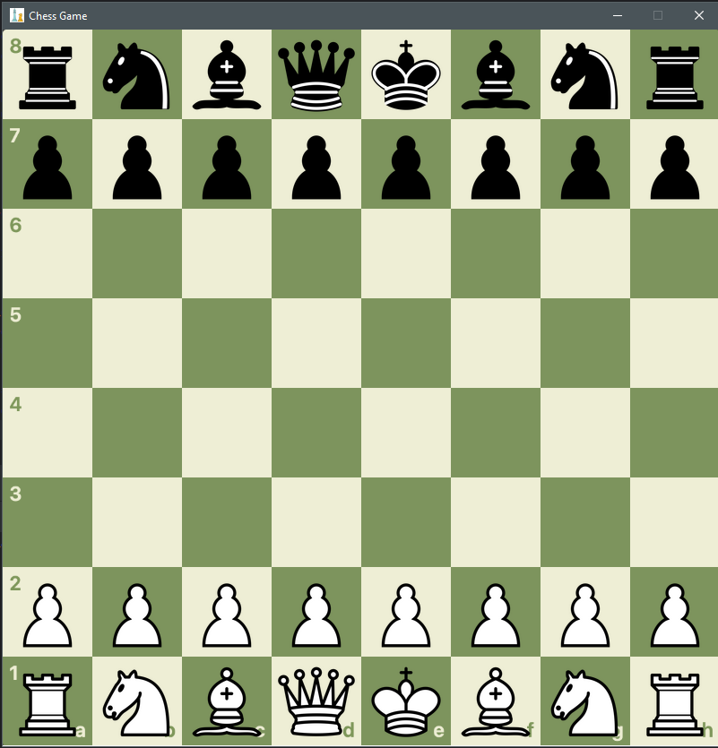

# Chess
This is a simple windows chess application I wrote inorder to get familiar with the javafx framework.

It also includes a puzzle gamemode and puzzle creator. The puzzles are stored as a specific String format in the postgres database.

It currently only works in windows because it needs a specific directory structure inorder to work.

Also includes customizable backgrounds and other features.

